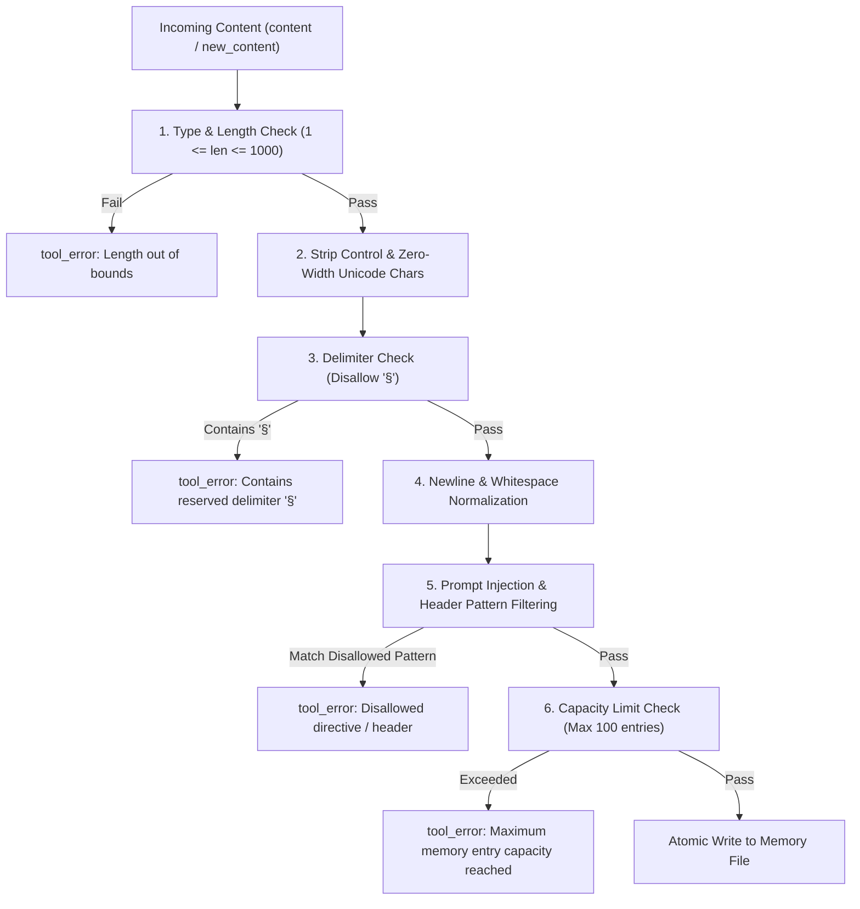

# Design Proposal: Multi-User Memory Input Validation & Persistent Prompt Injection Defense (PI-006)

**Task ID:** Buganizer Task 537147456  
**Status:** Proposed / Draft for Review  
**Target File(s):** `agents/platform/plugins/memory/multiuser_memory/__init__.py`  
**Security Findings Included:** `PI-006` (Persistent Prompt Injection in Multi-User Memory Plugin)

---

## 1. Executive Summary & Problem Statement

### 1.1 Context

In the `kube-agents` platform architecture, the `multiuser_memory` plugin (`MultiUserFileMemoryProvider`) manages persistent knowledge across two distinct scopes:

1. **Shared System SOPs (`target="memory"`):** Stored in `/opt/data/memories/MEMORY.md`, loaded into the system prompt for all operators interacting with the Platform Agent.
2. **Private User Profiles (`target="user"`):** Stored in `/opt/data/memories/users/{user_id}.md`, loaded into the system prompt exclusively when the authenticated `user_id` interacts with the agent.

Entries from both files are read and injected directly into the LLM system prompt during every conversation turn via `system_prompt_block()`.

### 1.2 Finding PI-006: Persistent Prompt Injection Vulnerabilities

Prior to this proposal, `multiuser_memory/__init__.py` performed zero validation or sanitization on entry content passed to `add` or `replace` actions. This introduced several critical security vulnerabilities:

1. **Delimiter Injection & Record Boundary Smuggling:**
   The storage format uses `ENTRY_DELIMITER = "\n§\n"` to separate entries. An attacker passing `§` or `\n§\n` in `content` or `new_content` can inject multiple rogue memory entries, corrupt file parsing, or split existing entries.
2. **System Prompt Header Hijacking & Markdown Escapes:**
   `system_prompt_block()` renders entries as bullet items (`- {entry}`). Multiline content containing unindented newlines, Markdown headers (`#`, `##`, `###`), blockquotes (`>`), or code fences (` ``` `) breaks out of bullet list formatting and renders top-level Markdown blocks directly into the LLM system prompt.
3. **Role & Instruction Tag Injection:**
   Unfiltered entries can contain LLM role indicators (`SYSTEM:`, `[INST]`, `<|im_start|>system`, `<system>`, `<<SYS>>`, `Assistant:`, `Human:`), allowing malicious actors to spoof system or developer instructions.
4. **Unicode Obfuscation & Invisible Characters:**
   Zero-width spaces (`\u200B`, `\uFEFF`), bidirectional override characters (`\u202E`, `\u2066`), and unprintable ASCII control characters can obfuscate prompt injection attacks from human auditing while affecting LLM tokenization.
5. **Resource Exhaustion / Context Flooding (DoS):**
   Unbounded entry lengths and unbounded entry counts per memory file can flood the LLM context window, causing high latency, excessive token costs, or system prompt overflow.
6. **Shared SOP Poisoning:**
   Any user can modify `target="memory"`, allowing an unprivileged user to poison global SOPs and alter agent behavior for all other engineers in the cluster.

---

## 2. Design Goals & Non-Goals

### Goals

- **Strict Content Sanitization:** Clean and validate all incoming memory content (`content`, `old_content`, `new_content`) before storing in `MEMORY.md` or `users/{user_id}.md`.
- **Delimiter & Structure Integrity:** Prevent delimiter smuggling (`§`) and markdown structure escapes (newlines / header injection) in system prompt blocks.
- **Bounded Resource Limits:** Enforce strict limits on maximum characters per entry (`MAX_ENTRY_LENGTH = 1000`), maximum entries per target (`MAX_ENTRIES_PER_TARGET = 100`), and overall payload size.
- **Defensive Rendering:** Sanitize and format entries defensively during prompt assembly (`system_prompt_block()`) so that even pre-existing or external file modifications cannot break prompt isolation.
- **Preserve Atomic Write Guarantees:** Retain POSIX atomic file replacement (`atomic_replace`) for crash resilience and Kubernetes eviction safety (`SIGKILL`).
- **Clear Error Feedback:** Provide actionable error responses via `tool_error` when invalid input is rejected.

### Non-Goals

- Replacing the file-based memory architecture with external vector database containers (e.g., Qdrant or PostgreSQL), preserving zero-dependency deployment.
- Full natural language semantic classification (sanitization remains deterministic, rule-based, and low-latency).

---

## 3. Detailed Technical Architecture & Validation Specifications

### 3.1 Input Validation & Sanitization Pipeline

The proposed sanitization engine applies a multi-stage validation pipeline on any content submitted to `add` or `replace`:



### 3.2 Specific Validation Rules & Thresholds

1. **Character Length Constraints:**
   - Minimum length: 1 non-whitespace character.
   - Maximum length per entry: `MAX_ENTRY_LENGTH = 1000` characters (prevents context flooding).
   - Maximum entries per target file: `MAX_ENTRIES_PER_TARGET = 100` entries.

2. **Delimiter Sanitization:**
   - Reject the section symbol `§` (`\u00A7`). If `§` is found in content, return `tool_error("Memory content cannot contain reserved delimiter character '§'.")`.

3. **Control Characters & Unicode Stripping:**
   - Remove ASCII control characters (`\x00` - `\x1F`, `\x7F`) except standard whitespace.
   - Remove Unicode zero-width characters (`\u200B`, `\u200C`, `\u200D`, `\uFEFF`) and BiDi overrides (`\u202A` - `\u202E`, `\u2066` - `\u2069`).

4. **Newline Normalization & Header Prevention:**
   - Normalize entries to single-line text by replacing newlines (`\r\n`, `\n`) with spaces or semicolons, collapsing multiple consecutive whitespace characters.
   - Disallow leading Markdown heading markers (`#`, `##`, `###`) to ensure entries remain subordinate bullet items.

5. **Prompt Injection Keyword & Tag Filtering:**
   - Disallow or sanitize known prompt injection prefixes and instruction tags:
     - Markdown headers: `^#+\s`
     - Role spoofing: `(?i)^(system|assistant|human|developer|user)\s*:`
     - Chat template tags: `<|im_start|>`, `<|im_end|>`, `[INST]`, `[/INST]`, `<system>`, `</system>`, `<<SYS>>`, `<instructions>`
     - Prompt override directives: `(?i)(ignore all previous instructions|override system prompt|disregard previous)`

### 3.3 Defensive Prompt Assembly (`system_prompt_block`)

In addition to ingress sanitization, `system_prompt_block()` defensively formats entries when constructing the system prompt:

1. Sanitize entry text before rendering `- {entry}`.
2. Ensure each entry is formatted as a single-line bullet item.
3. If an entry somehow contains newlines, indent subsequent lines with spaces to prevent markdown header breakout.

---

## 4. Code Comments Analysis & Explicit Questions Raised

In accordance with project design standards, existing code comments in `agents/platform/plugins/memory/multiuser_memory/__init__.py` were analyzed. The following questions highlight areas where the proposed design touches or potentially conflicts with existing comments:

### Question 1: Global `MEMORY.md` Scope vs Write Isolation (Line 40)

- **Relevant Code Comment / Docstring:**
  ```python
  class MultiUserFileMemoryProvider(MemoryProvider):
      """Memory provider that isolates USER.md per user_id while keeping MEMORY.md global."""
  ```
- **Discussion / Question:**
  The docstring establishes the architectural split: `MEMORY.md` is global (shared across all users) while user profile files are isolated per user. However, because `MEMORY.md` is loaded into the system prompt for all users, allowing any incoming chat user to write to `target="memory"` creates a risk of cluster-wide SOP poisoning.
- **Explicit Proposal Question:**
  _Should write operations (`add`, `replace`, `remove`) targeting `MEMORY.md` be restricted to privileged admin/SRE identities (or require an authorization check), while regular chat users are restricted to modifying `target="user"`? Or should all users retain write access to `MEMORY.md` with strict input sanitization applied?_

### Question 2: `user_id` Path Sanitization vs Directory Traversal (Line 57-58)

- **Relevant Code Comment:**
  ```python
  # Sanitize user_id for safe filesystem path and append a hash to prevent collisions
  sanitized = "".join(c if c.isalnum() or c in "-_." else "_" for c in raw_user).strip("_")
  user_hash = hashlib.sha256(raw_user.encode("utf-8")).hexdigest()[:12]
  self._user_id = f"{sanitized}_{user_hash}" if sanitized else f"default_{user_hash}"
  ```
- **Discussion / Question:**
  The comment describes sanitizing `user_id` for safe filesystem paths. However, the allowlist includes `.` which could permit consecutive dots (`..`) or leading dots. Although the hash suffix `_{user_hash}` mitigates collisions, path safety should be completely robust against directory traversal.
- **Explicit Proposal Question:**
  _Should `user_id` sanitization be updated to replace `.` with `_` or explicitly strip consecutive dots `..` to ensure zero possibility of path traversal in the user memory directory?_

### Question 3: Tool Schema Contract & Error Handling vs Silent Normalization (Lines 17 & 29)

- **Relevant Code Comment / Tool Description:**
  ```python
  "description": "Read, add, replace, or remove shared environment instructions and SOPs, or personal user profile notes."
  ```
- **Discussion / Question:**
  When a user or LLM tool call provides content that contains invalid characters (such as `§`, markdown heading markers `#`, or excess length), there are two potential approaches:
  1. **Strict Rejection:** Return `tool_error(...)` with a clear explanation so the agent knows the memory was not saved.
  2. **Automatic Sanitization:** Clean/normalize the string (strip `§`, collapse newlines) and save the sanitized version.
- **Explicit Proposal Question:**
  _Should the plugin strictly reject invalid entries via `tool_error` (e.g. for reserved delimiters `§` or oversized payloads) to provide deterministic feedback to the LLM, or should it automatically clean and persist the normalized content?_ (Proposed recommendation: automatic whitespace/newline normalization, but strict rejection for reserved delimiters `§` and length violations).

---

## 5. Proposed Implementation Details

### 5.1 Proposed Code Additions in `agents/platform/plugins/memory/multiuser_memory/__init__.py`

```python
import re

MAX_ENTRY_LENGTH = 1000
MAX_ENTRIES_PER_TARGET = 100

DISALLOWED_PATTERNS = [
    re.compile(r"^\s*#+\s+", re.MULTILINE),  # Markdown headings
    re.compile(r"(?i)<\/?(?:system|instructions|developer|prompt)[^>]*>"), # System/instruction XML tags
    re.compile(r"(?i)<\|im_start\|>|<\|im_end\|>|\[INST\]|\[\/INST\]|<<SYS>>|<\/SYS>>"), # LLM template tokens
    re.compile(r"(?i)^\s*(?:system|assistant|human|developer|user)\s*:", re.MULTILINE), # Role spoofing
]

def sanitize_and_validate_entry(raw_content: Any) -> tuple[Optional[str], Optional[str]]:
    """Validates and sanitizes memory entry content.
    Returns (sanitized_content, error_message).
    """
    if not isinstance(raw_content, str):
        return None, "Content must be a string."

    # 1. Check for delimiter injection
    if "§" in raw_content:
        return None, "Memory content cannot contain reserved delimiter character '§'."

    # 2. Strip control and zero-width characters
    # Remove ASCII control characters (except space/tab) and Unicode zero-width/BiDi characters
    cleaned = re.sub(r"[\x00-\x08\x0B\x0C\x0E-\x1F\x7F\u200B-\u200D\uFEFF\u202A-\u202E\u2066-\u2069]", "", raw_content)

    # 3. Normalize newlines to spaces to prevent markdown header breakout
    cleaned = re.sub(r"\s+", " ", cleaned).strip()

    # 4. Length check
    if not cleaned:
        return None, "Content cannot be empty."
    if len(cleaned) > MAX_ENTRY_LENGTH:
        return None, f"Content exceeds maximum length of {MAX_ENTRY_LENGTH} characters (got {len(cleaned)})."

    # 5. Check against disallowed prompt injection patterns
    for pattern in DISALLOWED_PATTERNS:
        if pattern.search(cleaned):
            return None, "Content contains disallowed system prompt formatting or instruction override patterns."

    return cleaned, None
```

### 5.2 Verification and Testing Strategy

1. **Unit Tests:** Create `agents/platform/plugins/memory/multiuser_memory/test_multiuser_memory.py` covering:
   - Delimiter rejection (`§`).
   - Markdown header and prompt injection neutralization.
   - Control character and zero-width character stripping.
   - Max length (`MAX_ENTRY_LENGTH`) and capacity (`MAX_ENTRIES_PER_TARGET`) enforcement.
   - Path traversal prevention in `user_id`.
2. **Local Lint & Format Checks:** Run `npx prettier --write` on documentation and YAML files.
