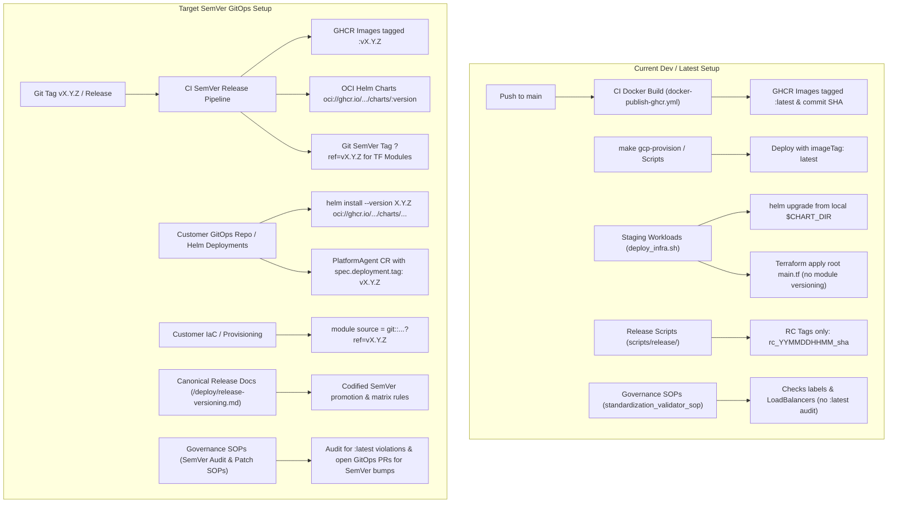

# Design: SemVer Deployment, Infrastructure & Operational Playbook Versioning

**Status:** Draft / Proposed  
**Author:** AI Coding Assistant  
**Date:** 2026-07-31

---

## 1. Executive Summary & Purpose

Currently, `kube-agents` is deployed to development and staging environments primarily using development builds, commit SHAs, and the `:latest` tag across container images, Kubernetes manifests, operator defaults, Helm charts, and Terraform scripts. While this supports fast iteration during early development, moving toward production-grade GitOps deployments requires strict adherence to **Semantic Versioning (SemVer 2.0.0)**.

This document provides a comprehensive architectural analysis of the current and proposed deployment setups in `kube-agents` (Helm charts, Terraform modules, Kustomize overlays, operator controllers, release documentation, and operational governance playbooks) and presents a detailed gap analysis and phased roadmap for adopting SemVer across all deployment artifacts.

---

## 2. Background & Pre-SemVer Architecture (Legacy vs. Shipped State)

> [!NOTE]
> This section describes the legacy pre-SemVer baseline that motivated this design. All target architecture changes described below now ship in `main`.

### 2.1 Container Images & CI/CD Pipelines

- **Publishing Workflows**: CI workflows (`.github/workflows/docker-publish-ghcr.yml`, `docker-publish-k8s-operator.yml`, `docker-publish-gcp.yml`) publish container images (`platform-agent`, `credential-proxy`, `replay-proxy`, `k8s-operator`) tagged with `:latest` and `${{ github.sha }}` on every push to `main`.
- **Release Candidate Automation**: `scripts/release/README.md` details an automated Release Candidate (RC) testing pipeline (`rc_YYMMDDHHMM_<short_sha>`) and validated tags (`*_validated`), but does not define an automated path for creating or promoting immutable SemVer release tags (`vMAJOR.MINOR.PATCH`).

### 2.2 Kubernetes Operator & Manifest Generation

- **Default Image Tags**: The `PlatformAgent` controller (`k8s-operator/internal/controller/manifest_helpers.go`, `k8s-operator/internal/controller/platformagent_manifests.go`) hardcodes default image references to `:latest` (`defaultPlatformAgentImage = "ghcr.io/gke-labs/kube-agents/platform-agent:latest"`, `name + ":latest"` for sidecars and init containers).
- **Kustomize & Interactive Scripts**: `k8s-operator/config/manager/kustomization.yaml` sets `newTag: latest`, and interactive deployment scripts (`k8s-operator/scripts/common.sh`) default `IMAGE_TAG` to `latest`.

### 2.3 Helm Charts & Deployment

- **Staging Workloads Chart**: The repository includes a workload simulation chart (`k8s-operator/testing/staging_workloads/charts/workload-bundle/Chart.yaml`) with static version metadata (`version: 0.1.0`, `appVersion: "1.0.0"`).
- **Local Directory Coupling**: `deploy_infra.sh` installs the chart directly from local disk (`$CHART_DIR`), without OCI registry packaging or versioned repository publishing.
- **Proposed Canonical Chart**: Documentation (`docs/site/src/content/docs/install/helm-and-kind.md`) outlines that a GKE-oriented Helm chart for installing `kube-agents` itself has been proposed but is not yet implemented in `main`.

### 2.4 Terraform Modules (`tf modules`)

- **Staging Workloads IaC**: `k8s-operator/testing/staging_workloads/main.tf` uses root-level scripts to provision GKE Autopilot and Standard clusters without reusable module encapsulation.
- **GitOps Customer IaC**: The reference GitOps repository (`examples/gitops-repo/README.md`) proposes Terraform HCL (`spec.iac.format: terraform`) for provisioning GKE clusters and GCP cloud resources, but lacks formal SemVer versioning, module registry/Git tag sourcing, or provider constraint pinning.

### 2.5 Operational Playbooks & Governance SOPs

- **Current SOP Scope**: Fleet-wide governance playbooks in `agents/platform/governance/` currently audit resource labeling (`app.kubernetes.io/name`, `owner`, `environment`) and GKE control plane/node CVEs (`security_patch_orchestrator_sop.md`), but lack rules to check container image tag immutability (`:latest` violations) or coordinate staged SemVer upgrades of `kube-agents` across clusters.

---

## 3. Architectural Diagram: Current vs. Target SemVer Flow

---

## 4. Comprehensive Gap Analysis Matrix

| Domain Area                                                            | Element / Component                                                     | Pre-PR 493 Implementation                                                                                                                                       | Shipped SemVer State (main)                                                                                                                                                  | Changes Landed in PR 493                                                                                                                                                                                |
| :--------------------------------------------------------------------- | :---------------------------------------------------------------------- | :-------------------------------------------------------------------------------------------------------------------------------------------------------------- | :--------------------------------------------------------------------------------------------------------------------------------------------------------------------------- | :------------------------------------------------------------------------------------------------------------------------------------------------------------------------------------------------------ |
| **1. Helm Deployments (Workloads & Agents)**                           | **Image References & Tag Fallbacks**                                    | Defaults to `:latest` in `manifest_helpers.go` (`defaultPlatformAgentImage`), `platformagent_manifests.go` (sidecars/init containers), and `scripts/common.sh`. | All Deployments use explicit SemVer tags (`vX.Y.Z`). Operator defaults to the controller's release version instead of `latest`.                                              | • Remove `:latest` hardcodes in Go controller and scripts. • Inject operator release version as default tag at build time. • Update `kustomization.yaml` (`newTag: latest` → SemVer placeholder). |
|                                                                        | **Helm Values Schema (`values.yaml`)**                                  | `workload-bundle` templates hardcode image tags or lack structured SemVer image overrides.                                                                      | Pinned default SemVer tags in `values.yaml` (`image.tag: ""`, defaulting to `Chart.appVersion`).                                                                             | • Standardize `values.yaml` schema with `image.repository`, `image.tag`, and `image.pullPolicy: IfNotPresent`. • Add linting rules to forbid `:latest` in charts.                                    |
|                                                                        | **Image Pull Policy**                                                   | Frequently set to `Always` (`platform-agent.yaml.template:25`) due to `:latest` mutability.                                                                     | `IfNotPresent` for SemVer tags (immutable), `Always` only for dev/SHA tags.                                                                                                  | • Dynamically set `imagePullPolicy` in templates and Go controller based on whether tag is SemVer vs. dev/latest.                                                                                       |
| **2. Helm Charts Themselves (`Chart.yaml` & OCI)**                     | **Chart SemVer & AppVersion**                                           | Hardcoded `version: 0.1.0` and `appVersion: "1.0.0"` in `workload-bundle/Chart.yaml`.                                                                           | Automated bumping of `version` (chart structure) and `appVersion` (workload/app release) adhering to SemVer 2.0.0.                                                           | • Implement release helper script to bump `Chart.yaml` versions on release. • Document versioning rules (`version` vs `appVersion`).                                                                 |
|                                                                        | **Chart Distribution & Registry**                                       | Installed from local disk (`$CHART_DIR` in `deploy_infra.sh`). No chart registry or repository.                                                                 | Published as OCI artifacts to GHCR (`oci://ghcr.io/gke-labs/kube-agents/charts/<chart>:<version>`).                                                                          | • Add GitHub Actions workflow (`chart-release.yml`) using `helm lint`, `helm package`, and `helm push` to GHCR. • Replace local path calls with versioned OCI pulls.                                 |
|                                                                        | **Chart Documentation & Proposed Chart**                                | Docs mention proposed GKE-oriented `kube-agents` chart not in `main`.                                                                                           | Production-ready `charts/kube-agents/` chart at repository root.                                                                                                             | • Create official `charts/kube-agents/` chart wrapping CRDs, Operator, and PlatformAgent profiles.                                                                                                      |
| **3. Terraform Modules (`tf modules`)**                                | **Module Structure & Encapsulation**                                    | Root-level scripts in `k8s-operator/testing/staging_workloads/main.tf` with no reusable module hierarchy.                                                       | Clean, reusable Terraform modules under `terraform/modules/<module-name>/` (`main.tf`, `variables.tf`, `outputs.tf`).                                                        | • Create standard root folder `terraform/modules/` • Extract cluster provisioning, Workload Identity, and IAM into versioned modules.                                                                |
|                                                                        | **Module Versioning & Sourcing**                                        | No module versioning; applied directly from local checkout.                                                                                                     | Consumers source modules via SemVer Git release tags (`?ref=vX.Y.Z`).                                                                                                        | • Adopt SemVer Git tagging syntax in documentation and customer GitOps templates (`examples/gitops-repo`).                                                                                              |
|                                                                        | **Terraform & Provider Version Constraints**                            | `required_version = ">= 1.0"`, `version = "~> 5.0"` in `staging_workloads/main.tf`.                                                                             | Pinned minimum minor versions with upper bounds (`~> 1.5`, `~> 5.30`).                                                                                                       | • Strict version constraints across all Terraform blocks. • CI linting (`terraform fmt -check`, `tflint`, `terraform validate`).                                                                     |
| **4. Release Documentation & Operational Playbooks (Governance SOPs)** | **Release Documentation & RC Promotion Guide**                          | `scripts/release/README.md` documents RC tagging (`rc_*`). `docker-images.md` only explains `:latest` and SHA pushes on `main`.                                 | Comprehensive user-facing release guide (`docs/site/src/content/docs/deploy/release-versioning.md`) detailing SemVer promotion, chart versioning, and TF module ref pinning. | • Create `release-versioning.md` in site docs. • Document how to promote RC candidates (`*_validated`) to `vMAJOR.MINOR.PATCH` releases. • Create compatibility matrix table.                     |
|                                                                        | **Standardization Validator SOP (`standardization_validator_sop.md`)**  | Checks labeling (`app.kubernetes.io/name`, etc.) and public LoadBalancer exposure, but ignores `:latest` tags.                                                  | Audits every Pod/Deployment spec across the fleet and flags `:latest`, untagged, or mutable SHA tags as High-Risk Architectural Violations.                                  | • Add Rule 3 (`Immutable Image Tag Compliance`) to `standardization_validator_sop.md`. • Enforce that staging/prod namespaces use explicit SemVer tags.                                              |
|                                                                        | **Security Patch & Upgrade SOP (`security_patch_orchestrator_sop.md`)** | Audits GKE control plane and node CVEs and opens GitOps PRs for GKE upgrades. Does not track `kube-agents` SemVer releases.                                     | Coordinates staggered dev/staging → prod GitOps PRs (`submit-suggestion`) to upgrade `PlatformAgent`, operator, and sidecars to the latest SemVer release.                   | • Extend `security_patch_orchestrator_sop.md` to query GHCR / GitHub Releases for new `kube-agents` SemVer tags. • Add procedure for automated PR upgrades of agent components.                      |
|                                                                        | **Release Validation Playbook / SOP**                                   | No automated playbook verifying release readiness across GHCR images, OCI charts, and Terraform tags.                                                           | Operational playbook (`release_validation_sop.md`) that verifies image digests, OCI chart availability, and Terraform syntax before SemVer tag publication.                  | • Author `agents/platform/governance/release_validation_sop.md` to check artifact availability and compatibility prior to release promotion.                                                            |

---

## 5. Architectural & Design Decisions

1. **OCI Registry for Helm Charts vs. Traditional Chart Repository**:
   - Versioned Helm charts will be published as **OCI artifacts** directly to GitHub Container Registry (`oci://ghcr.io/gke-labs/kube-agents/charts/<chart-name>:<version>`) using `helm push` in GitHub Actions. This leverages existing GHCR authentication and storage infrastructure.
2. **Terraform Module Git Ref Sourcing**:
   - Reusable Terraform modules will be structured under `terraform/modules/<module-name>` and referenced in customer GitOps layouts via **SemVer Git release tags** (`git::https://github.com/gke-labs/kube-agents.git//terraform/modules/<module-name>?ref=vX.Y.Z`), eliminating the operational overhead of a separate Terraform Registry backend.
3. **Release Candidate (RC) vs. SemVer Production Promotion**:
   - Pre-release validation environments continue to use RC tags (`rc_YYMMDDHHMM_<sha>`). Once an RC build passes all end-to-end tests and receives the `*_validated` tag, a release workflow tags the commit with `vMAJOR.MINOR.PATCH`, triggering the publication of immutable GHCR images and OCI Helm charts.

---

## 6. Implementation Roadmap

### 6.1 Phase 1: Container Images & Operator SemVer Alignment

1. **CI Workflows**:
   - Update `.github/workflows/docker-publish-ghcr.yml` and `docker-publish-k8s-operator.yml` to trigger on `push: tags: ['v*.*.*']` and tag GHCR images with `vX.Y.Z`.
2. **Operator Defaults**:
   - Replace hardcoded `defaultPlatformAgentImage = "...:latest"` in `manifest_helpers.go` with a configurable version constant (`OperatorVersion`), defaulting generated Deployments to the controller's release version.

### 6.2 Phase 2: Helm Chart Structure & OCI Release Pipeline

1. **Canonical Chart (`charts/kube-agents/`)**:
   - Implement the official GKE-oriented `kube-agents` Helm chart containing CRDs, Operator Deployment, and PlatformAgent Custom Resource templates.
2. **OCI Publishing Action**:
   - Add `.github/workflows/chart-release.yml` to run `helm lint`, `helm package`, and `helm push oci://ghcr.io/gke-labs/kube-agents/charts/` on SemVer git tag pushes.

### 6.3 Phase 3: Terraform Reusable Modules & SemVer Sourcing

1. **Module Restructuring**:
   - Extract `k8s-operator/testing/staging_workloads/main.tf` into modular, reusable packages under `terraform/modules/gke-cluster/` and `terraform/modules/kube-agents-iam/`.
2. **GitOps Documentation**:
   - Update `examples/gitops-repo/` and architecture specifications (`docs/architecture/06-api-and-data-contracts.md`) to demonstrate SemVer Git ref sourcing (`?ref=vX.Y.Z`).

### 6.4 Phase 4: Release Documentation & Playbooks / Governance SOPs

1. **Release Documentation**:
   - Create `docs/site/src/content/docs/deploy/release-versioning.md` detailing the promotion of RC builds to `vMAJOR.MINOR.PATCH` releases and version compatibility matrices.
2. **Governance SOP Enhancements**:
   - Extend `agents/platform/governance/standardization_validator_sop.md` with **Rule 3 (Immutable Image Tag Compliance)** to flag `:latest` tags in staging/prod namespaces.
   - Extend `agents/platform/governance/security_patch_orchestrator_sop.md` to automate checking for new `kube-agents` SemVer releases and opening GitOps PRs (`submit-suggestion`).
   - Author `agents/platform/governance/release_validation_sop.md` to verify image digests, OCI chart accessibility, and Terraform validation before release promotion.
